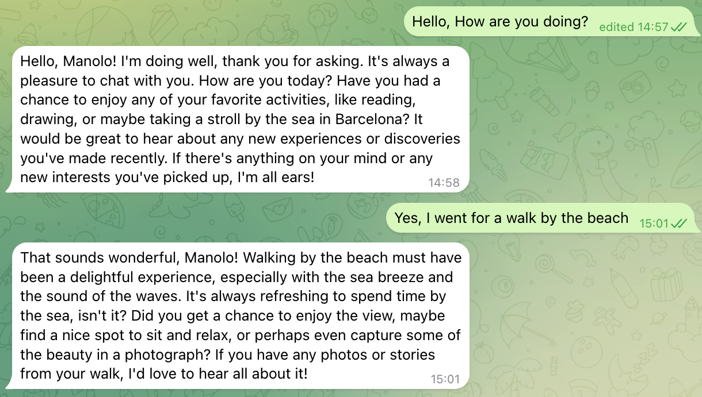

# Telegram Bot

An LLM-powered Telegram chatbot that leverages personal context to provide tailored conversational experiences.

## Overview
This bot interacts with users by processing messages through Large Language Models, utilizing either local inference or cloud-based providers. It is designed to maintain a specific persona or context provided during setup.

## Features
* **Context-Aware Chat:** Uses provided background data to inform LLM responses.
* **Flexible Backend:** Supports multiple LLM execution paths:
    * **Local:** Integration with [Ollama](https://ollama.com/).
    * **Cloud:** Provider-based inference via [AWS Bedrock](https://aws.amazon.com/bedrock/).
* **Reliable Hosting:** Configured for seamless deployment on [Railway](https://railway.app/).

## Example

> **Note:** More advanced versions of this bot, including agentic workflows and specialized tool-calling, are hosted in private repositories.

## Tech Stack
* **Infrastructure:** Railway
* **Interface:** Telegram Bot API
* **AI Orchestration:** Ollama / AWS Bedrock

---

## Author
**Ulises Rey**